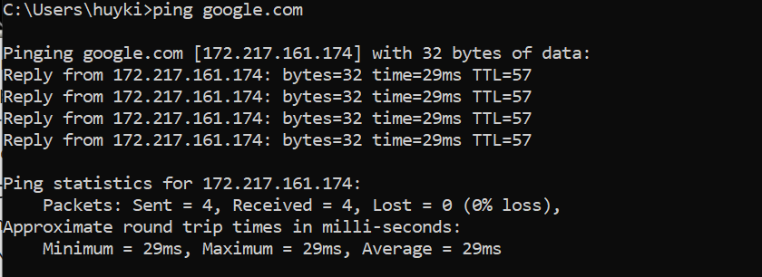

# Ping 

Ping là một công cụ internet cơ bản cho phép người dùng xác minh rằng một địa chỉ ip cụ thể tồn tại và có thể chấp nhận các yêu cầu. 

Ping được sử dụng chuẩn đoán để đảm bảo rằng một máy tính chủ mà bạn đang cố truy cập đang thực sự hoạt động.

Ví dụ nếu người dùng không thể ping tới máy chủ, thì người dùng người dùng sẽ không thể sử dụng giao thức truyền tệp(FTP) để gửi tệp đến máy chủ đó. Ping cũng có thể được sử dụng với máy chủ đang hoạt động để xem mất bao lâu để nhận lại phản hồi.

Sử dụng ping bạn có thể tìm hiểu dạng số của địa chỉ ip từ tên miền tượng trưng 

Ví dụ:

Địa chỉ IP của tên miền `news.cloud365.vn`: `103.101.161.246`

* Ping hoạt động bằng cách gửi một gói tin đến một địa chỉ được chỉ định và chờ phản hồi. Ping(Packet Internet hoặc Inter-Network Groper) 

* Ping cũng có thể đề cập tới quá trình gửi tin nhắn đến tất cả các thành viên của danh sách gửi ACK(mã xác nhận). Điều này được thực hiện trước khi gửi mail để xác nhận rằng tất cả các địa chỉ đều có thể truy cập được

### Hoạt động của Ping 
* Ping hoạt động giống như dội âm sonar, gửi một gói thông tin nhở chứa ICMP ECHO_REQUEST đến một máy tính được chỉ định, sau đó sẽ gửi lại một gói tin ECHO_REPLY

### Cách sử dụng Ping:
* Access: Bạn có thể sử dụng Ping để xem liệu bạn có thể kết nối với máy tính khác, thì đó là một dấu hiệu khá tốt cho thấy mạng internet của bạ đang hoạt động hoặc không.

* **Time & Distance**: Bạn có thể sử dụng lệnh ping để xác định mất bao lâu để trả một gói để trả một gói tin từ một trang web khác, lệnh này cho bạn biết khoảng thời gian Internet của nó trong điều kiện mạng. Ví dụ, một trang web có vẻ chậm, bạn có thể so sánh khoảng cách ping với các trang web khác trên internet để xác định xem đó là trang web, mạng hay hệ thống của bạn chậm. Bạn cũng có thể so sánh thời gian ping để biết trang web nào có tốc độ tru vấn mạng nhanh nhất và hiệu quả nhất để tải xuống, trò chuyện và các úng dụng khác nhau.
* **Domain IP address**: Bạn có thể sử dụng lệnh Ping để thăm do tên miền hoặc địa chỉ IP. Nếu bạn ping một tên miền, nó sẽ hiển thị hữu ích địa chỉ IP tương ứng phản hồi.

vd:

Khi ping tới địa chỉ Domain thì ping sẽ hiểu và ping tới Địa chỉ IP tương ứng mà gắn cho Domain đó.

* Online ping: Nếu bạn không thể sử dụng lệnh ping từ máy tính của mình do tường lửa hoặc các hạn chế khác hoặc muốn thực hiện ping Internet từ một vị trí khác không phải của mình,